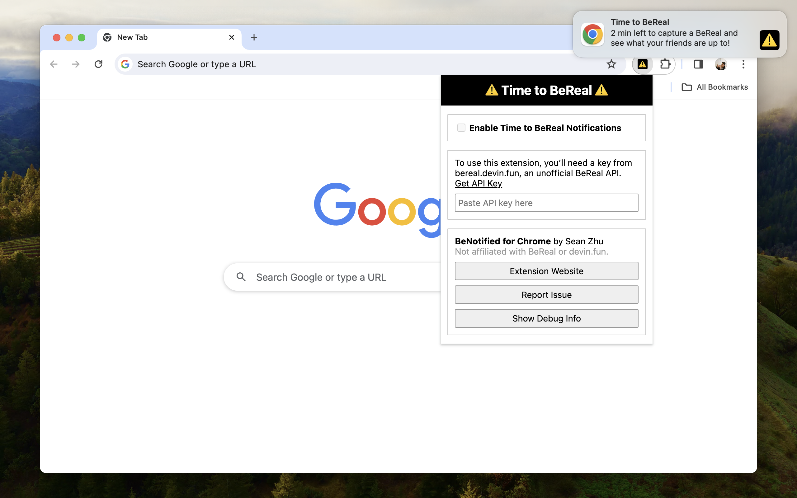

# BeNotified

_Desktop notifications for when it’s Time to BeReal!_

Keeping your phone next to you when you’re working can be distracting! If you’re a [BeReal](https://bereal.com/) user and want to leave your phone across the room or on airplane mode but still want to know when it’s ⚠️ Time to BeReal ⚠️, this (unofficial) Chrome extension can help.

This extension uses an unofficial BeReal API at [bereal.devin.fun](https://bereal.devin.fun/).

This extension is not affiliated with BeReal or devin.fun.

## How to install

1. Click the green **Code** button, and click **Download ZIP**.
2. In Chrome, go to: `chrome://extensions`
3. At the top-right, turn on **Developer mode**.
4. Click **Load unpacked**, then choose the folder you just downloaded. (Alternatively, drag the folder into the Chrome tab.)

## FAQ

### Is this on the Chrome Web Store?

No, but it wouldn’t be hard to publish it. Please [file an issue][issues] if you want this.

### Does this work on other browsers?

This extension works with desktop Chromium browsers, including Chrome, Edge, Opera, and Arc. Please [file an issue][issues] if you would like this available for non-Chromium browsers.

### Does this work on mobile?

No, but there is [an](https://apps.apple.com/us/app/bereal-your-friends-for-real/id1459645446) [app](https://play.google.com/store/apps/details?id=com.bereal.ft) you can download for that.

### Is there a way to use this without an API key?

Getting an API key from [bereal.devin.fun](https://bereal.devin.fun/) takes a while, which isn‘t ideal. I’m working on a solution that lets people use this extension immediately after installing it with no further configuration needed.

### Which time zone does this use?

~~This extension is currently hardcoded to use the Americas BeReal time zone, but it would not be hard to add an option to change the time zone. Please [file an issue][issues] if you would like this.~~\
You can now select any time zone, thanks to [PR #2](https://github.com/szhu/BeNotified/pull/2)!

### How do I report a bug?

[File an issue here.][issues]

[issues]: https://github.com/szhu/BeNotified/issues
