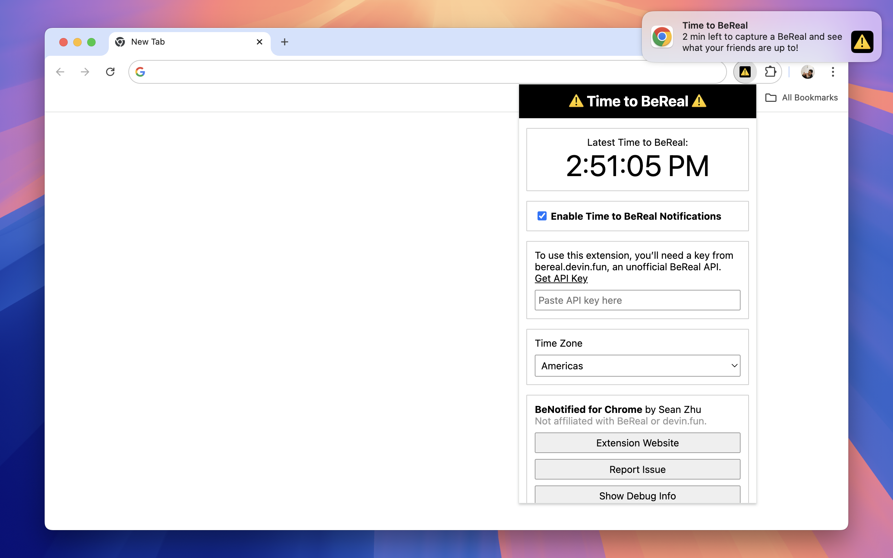

# BeNotified

_Desktop notifications for when it’s Time to BeReal!_

[BeReal](https://bereal.com/) helps you use your phone less, but you still need it nearby to catch the daily notification. If you prefer leaving your phone across the room or on airplane mode while you're working on your computer, use this Chrome extension to get a notification when it’s ⚠️ Time to BeReal ⚠️.

**Unofficial project:** This project is not affiliated with BeReal. Data is provided via an unofficial BeReal API at [bereal.devin.fun](https://bereal.devin.fun/). This project is also not affiliated with devin.fun, [but Devin has starred this project](https://github.com/szhu/BeNotified/stargazers) 🙂

## How to install

This extension works with desktop Chromium browsers, including Chrome, Edge, Opera, and Arc.

1. Go to [Releases](https://github.com/szhu/BeNotified/releases) and download the latest `benotified-VERSION.zip` file.
2. In Chrome, go to: `chrome://extensions`
3. At the top-right, turn on **Developer mode**.
4. Drag the zip file you just downloaded into the Chrome tab.

**Developers:** To install for development, the steps are similar. Instead of downloading the release, `git clone` this repo and `yarn install` the dependencies. For the last step, drag the repo folder into the Chrome tab.

## FAQ

### Is this on the Chrome Web Store?

No, but it wouldn’t be hard to publish it. Please [submit an issue][issues] if you want this.

### Does this work on other browsers?

Please [submit an issue][issues] if you would like this available for non-Chromium browsers like Firefox or Safari.

### Does this work on mobile?

No, but there is [an](https://apps.apple.com/us/app/bereal-your-friends-for-real/id1459645446) [app](https://play.google.com/store/apps/details?id=com.bereal.ft) you can download for that.

### Is there a way to use this without an API key?

Getting an API key from [bereal.devin.fun](https://bereal.devin.fun/) takes a while, which isn‘t ideal. I have a potential solution that lets people use this extension immediately after installing it with no further configuration needed, but I haven't worked on it. Please [submit an issue][issues] if this would be helpful.

### Which time zone does this use?

~~This extension is currently hardcoded to use the Americas BeReal time zone, but it would not be hard to add an option to change the time zone. Please [submit an issue][issues] if you would like this.~~\
You can now select any time zone, thanks to [PR #2](https://github.com/szhu/BeNotified/pull/2)!

### How do I report a bug?

[Submit an issue here.][issues]

[issues]: https://github.com/szhu/BeNotified/issues
